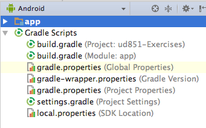
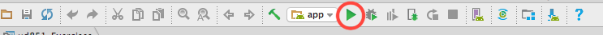
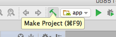
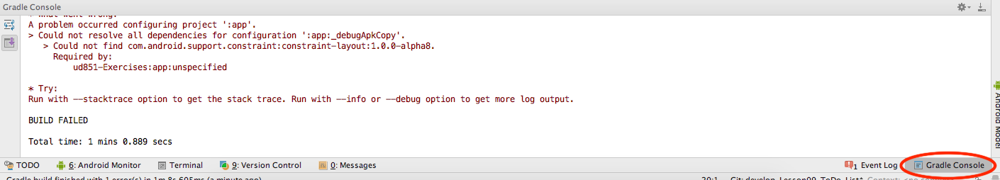
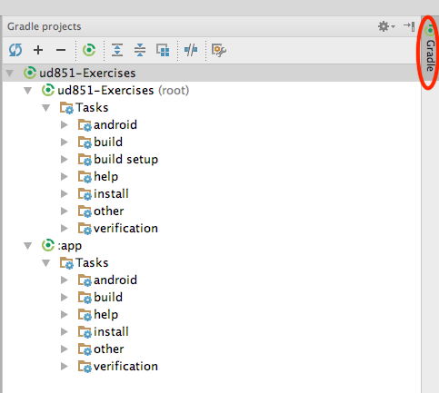
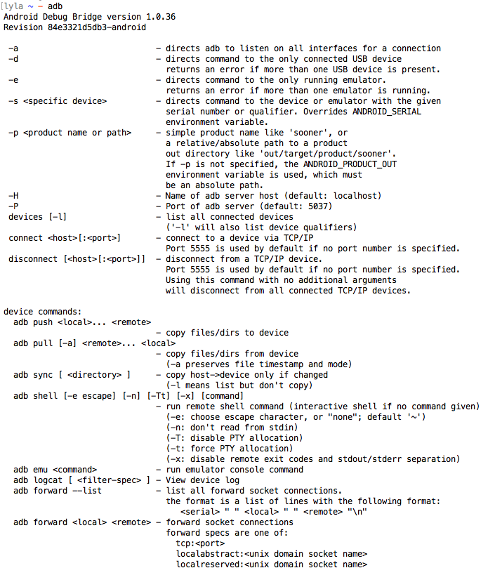
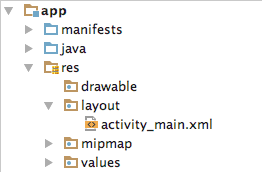
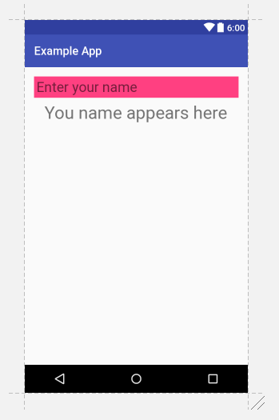

###### Title: Lesson 2 - Create Project Sunshine / Subject: Grow with Google Challenge Scholarship: Android Dev
###### Author: M. Rzucidlo / mfrstatements@yahoo.com / Web: https://github.com/mickrz/
---

### __ Grow with Google Challenge Scholarship: Android Dev __

** Note: Some images and text were copied from the class lessons. **

Lesson 2
# Create Project Sunshine
## Introduction
* Hi!

## Are you ready?
This course assumes you are comfortable working in Java. In addition we assume that you have some basic familiarity with XML (or HTML), GitHub, networking and threading.

### Reference Courses if you don't have prerequisites:
* [Android Development for Beginners](https://www.udacity.com/course/android-development-for-beginners--ud837): This is the first course in a series of free courses about Android development. It assumes no programming knowledge and is perfect for the beginner student who wants to jump quickly into making an Android app. You'll learn Android in parallel to learning basic Java. After this course, you may wish to take our other beginner courses for User Input, Multi-Screen Apps, Networking and Data Storage.

* [Android Basics Nanodegree Program](https://www.udacity.com/course/android-basics-nanodegree-by-google--nd803): To add features and support on top of our free courses, sign up for the Android Basics Nanodegree Program to get access to ten projects, code reviews, personalized feedback, one-on-one appointments and moderated forums. If you'd like to build a portfolio of Android projects and have the support of Udacity mentors and staff, this option is for you.

* [Java Programming Basics](https://www.udacity.com/course/java-programming-basics--ud282): If you'd like an introduction to pure Java programming, consider taking this course, a deep dive into the basics of Java.

* [Git and Github](https://www.udacity.com/course/how-to-use-git-and-github--ud775): If you're not sure what GitHub is all about, take this course to help you manage your code and collaborate with other developers.

* [Android Development for Beginners - Lesson 1](https://www.udacity.com/course/android-development-for-beginners--ud837): If you've never worked with a language like XML or HTML but you're familiar with Java, consider taking the first lesson of the Android Development for Beginners class. It is solely focused on XML layouts for Android.

## Introducing Project Sunshine
* weather app - easy to conceptualize
* cover most of th APIs that are important

## A Brief Introduction to Android Studio
* Android Studio strongly recommended
* environment used for the course
* link to download AS: https://developer.android.com/studio/index.html
* AS installation [mini-course](https://classroom.udacity.com/courses/ud808/lessons/4216368924/concepts/43072785890923#)
* use either emulator or device though slack users recommended using actual device as emulation can be MUCH slower

## Coding, Github and Flow
* code on github
* exercises have steps to follow; TODO tab at bottom, press shift twice and type TODO if not found; allows to navigate, filter and get previews of source code
* contains solutions
* [Sunshine Repo](https://github.com/udacity/ud851-Sunshine)
* [Toy Repo](https://github.com/udacity/ud851-Exercises)

## Creating Our First Project
+ Start by creating New Project Wizard in AS
  - wizard creates all files to get started
  - Add Application name, typically company domain you own
  - Android uses Java standard of elements of domain in reverse order to construct the app package name
  - For dist purposes on Google Play & elsewhere, package name must be globally unique across all packages installed on Android.
  - Choose Project location
  - Select form factors that app will run on
  - Select "Empty Activity"
  - For backwards compatibilty leave next two options checked
* [App manifest](https://developer.android.com/guide/topics/manifest/manifest-element.html)

+ Starter project created bunch of settings
  - File / Project Structure / app / Flavors / 
  - Version code describes app version,
  - min sdk version
  - target sdk version

## Setting Min and Target Versions
* Android 1.0 launched in 2008, and in just the 8 years since - there have been 13 new major platform releases. By convention, each release is named off of a sugary treat, and the releases are named alphabetically.
* On the [Android Developer site](https://developer.android.com/about/dashboards/index.html#Platform), we show the relative percentage of active Android devices running a given platform version.
* distrubution of devices is roughly a bell curve with Lollipop with the most devices running it
* [Supporting Multiple Screens](https://developer.android.com/guide/practices/screens_support.html) - explains densities

### Setting minSDK
* The minSDK is the lowest SDK level that your app can run on
* You can choose what level of devices to support.
* Setting the minSDK acts as a filter -- Google Play won’t show your app on devices running an Android platform version lower than your minimum SDK version.
* Why not just set the minSDK to 1 and support everyone?
  - Generally, target as many users as you can, but there's a cost associated with supporting older versions
    - things like creating different execution paths around deprecated or updated APIs,
    - presenting a different UX to devices with different features.
  - Need to balance the opportunity of expanding your audience, with the cost of supporting those users.
* Each release introduces new APIs and hardware support, so it may not make sense to make your app available to devices that don’t support your minimum feature set.
* Some examples of hardware support and features, tied to releases.
  - Home screen widgets (Cupcake)
  - Multiple finger tracking (Froyo)
  - Tablet (Honeycomb)
  - Android Beam (Jellybean)
  - Android TV, Auto, Wear (Lollipop)
  - Pro Audio (Marshmallow)

### Setting targetSDK
* By comparison, the targetSDK is NOT a high pass filter
  - used only to declare which platform version you've tested your app on.
  - An app targeted to a certain API or Android version will continue to be forward compatible on future releases
    - the platform uses the target SDK values in case a future release makes a significant change to expected behavior, ensuring your app doesn’t break when a user’s phone gets upgraded. `
* Android Studio by-default targets the latest release.
  - If you’re developing a new app, there’s really no reason to target anything but the latest Android version,
  - once your app has been released, make it a point to update your target SDK and test as soon as possible when new platform releases roll out, so your app can take advantage of every new platform optimization and improvement.
  
## Running Your Code
* Create a device to eumlater AVD to test on variety of devices and screen sizes
* runs not just app but also android stack
* [Troubleshooting Intel® HAXM](https://software.intel.com/en-us/blogs/2014/03/14/troubleshooting-intel-haxm)
* [Run Apps on the Android Emulator](https://developer.android.com/studio/run/emulator.html)
* [Run Apps on a Hardware Device](https://developer.android.com/studio/run/device.html)

## Android Software Stack
* Android base is Linux kernel that handles hardware, drivers & power mgmt
* Next layer up is C/C++ libs and Android runtime along with core Android libs
* Apps run in own instance of runtime using classes and services in Application framework
* On top of that is Application layer, where all apps are
* code is compiled into bytecode doen by Gradle

### Advanced Build Options
#### Gradle in Android Studio
* Gradle is the build system of choice for Android Studio. 
* When you make a project, there are a few gradle build scripts automatically generated for you, shown below:


* When you press the green Run button, if the project has changed, the build scripts will run.


* To explicitly run the build scripts, you can press the Make Project button.



* To observe logs and build errors for gradle, Android Studio includes a Gradle Console.


* A gradle task represents a single, atomic piece of work for a build. To see a list of tasks, you can open the tasks window in Android Studio by clicking on the gradle button on the far right. Clicking on the name of the task runs that task.


#### Gradle from the Command Line
* Run gradle build tasks from the command line if preferred. To start, navigate to the root of your project folder. From there run:
`./gradlew tasks`

* This will give full list of runnable tasks.
* May need to run chmod +x on gradlew before can run it.
* See this link for more detailed instructions. To learn more, check out [Udacity's Gradle course](https://classroom.udacity.com/courses/ud867/lessons/3968239469/concepts/42836685960923).

#### Android Debug Bridge
* ADB is a command line utility included with Android's SDK.
* Can read up on [adb](https://developer.android.com/studio/command-line/adb.html?utm_source=udacity&utm_medium=mooc&utm_term=android&utm_content=adb&utm_campaign=training) and other command line tools.

* When typing adb into a terminal, there's also get a helpful list of everything adb can do


* For example, to start android app from the command line, type:
`adb shell am start -n com.package.name/com.package.name.ActivityName`

## Activity, Packages & Layouts
* Apps are collection of Connected components
* Four types of components that make up apps
  - Activity
    - responsible for most app user interaction,
    - single focused thing that the user can do
    - responsible for creating the window that your application uses to draw and receive events from the system
    - Only the Activity is an Android Component and responsible for displaying the application user interface. 
      - The rest are also part of the framework.
      - Services and Content Providers are both core Android components.
      - Layouts and Windows are both involved with displaying the user interface.
  - Services
  - broadcast receivers
  - content providers
* All are registered in Android manifest - used to register components with the Android framework.
* Launcher - in Android manifest inside activity component is intent filter tag that contains mentioning a launcher which is how activity is registered with launcher
* Each activity contains a layout that provides the system with detailed info as to what to display, how to display
* Res folder 
  - where Android stores application resources which makes it easy to maintain/modify as its separated from code
  -  contains images, strings and styles
* activity_main.xml - stores all of its layout files in XML format - XML tags refer to types of view objects in the UI framework
  
## Android Layouts Primer
* Here is a quick reference of these important concepts and how they work together.
* If never worked with a language like XML or HTML before, head over to the [Android Basics class on Android Layouts class](https://www.udacity.com/course/android-development-for-beginners--ud837) and take the first lesson.

### Activities and Layouts 
* An activity is a single focused thing that the user can do.
* Activities are responsible for creating the window that your application uses to draw and receive events from the system.
* Activities are written in Java, extending from the Activity class.
* An activity creates views to show the user information, and to let the user interact with the activity.
* Views are a class in the Android UI framework.
* They occupy a rectangular area on the screen and are responsible for drawing and handling events.
* An activity determines what views to create (and where to put them), by reading an XML layout file.
* These XML files are stored in the res folder inside the folder labeled layouts.



### Layout XML
* So what does this XML look like? Here's an example:
```
<?xml version="1.0" encoding="utf-8"?>
<LinearLayout xmlns:android="http://schemas.android.com/apk/res/android"
   xmlns:tools="http://schemas.android.com/tools"
   android:layout_width="match_parent"
   android:layout_height="match_parent"
   android:orientation="vertical"
   android:padding="16dp"
   tools:context="com.example.android.exampleapp.MainActivity">

   <EditText
       android:id="@+id/edit_text_name_input"
       android:layout_width="match_parent"
       android:layout_height="wrap_content"
       android:background="@color/colorAccent"
       android:hint="Enter your name"
       android:padding="4dp"
       android:textSize="24sp" />

   <TextView
       android:id="@+id/text_view_name_display"
       android:layout_width="wrap_content"
       android:layout_height="wrap_content"
       android:layout_gravity="center"
       android:layout_marginTop="8dp"
       android:text="Your name appears here"
       android:textSize="30sp" />
</LinearLayout>
```

* This looks like the following on a phone screen:


 

* A few examples of common container views are:

Class Name   | Description
--- | ---
[LinearLayout](https://developer.android.com/reference/android/widget/LinearLayout.html)   | Displays views in a single column or row.
[RelativeLayout](https://developer.android.com/reference/android/widget/RelativeLayout.html)   | Displays views positioned relative to each other and this view.
[FrameLayout](https://developer.android.com/reference/android/widget/FrameLayout.html)   | A ViewGroup meant to contain a single child view.
[ScrollView](https://developer.android.com/reference/android/widget/ScrollView.html)   | A FrameLayout that is designed to let the user scroll through the content in the view.
[ConstraintLayout](https://developer.android.com/reference/android/support/constraint/ConstraintLayout.html)   | This is a newer viewgroup; it positions views in a flexible way. We’ll be exploring constraint layout later in the lesson.
[NestedScrollView](https://developer.android.com/reference/android/support/v4/widget/NestedScrollView.html)   | NestedScrollView is just like ScrollView, but it supports acting as both a nested scrolling parent and child on both new and old versions of Android. Nested scrolling is enabled by default
* Note that layout views can be nested in one another, so you can nest a LinearLayout inside of a LinearLayout if you so choose.
* [more info on scrolling techniques] (https://material.io/guidelines/patterns/scrolling-techniques.html#scrolling-techniques-app-bar-scrollable-regions)

### XML Attributes
* Views have attributes in XML which control the properties of the view. Here’s an example from before:

```
<?xml version="1.0" encoding="utf-8"?>
<LinearLayout xmlns:android="http://schemas.android.com/apk/res/android"
   xmlns:tools="http://schemas.android.com/tools"
   android:layout_width="match_parent"
   android:layout_height="match_parent"
   android:orientation="vertical"
   android:padding="16dp"
   tools:context="com.example.android.exampleapp.MainActivity">


   <EditText
       android:id="@+id/edit_text_name_input"
       android:layout_width="match_parent"
       android:layout_height="wrap_content"
       android:background="@color/colorAccent"
       android:hint="Enter your name"
       android:padding="4dp"
       android:textSize="24sp" />


   <TextView
       android:id="@+id/text_view_name_display"
       android:layout_width="wrap_content"
       android:layout_height="wrap_content"
       android:layout_gravity="center"
       android:layout_marginTop="8dp"
       android:text="Your name appears here"
       android:textSize="30sp" />
</LinearLayout>
```

* The properties are things like textSize and padding.
* Every view has a handful of properties associated with them, which can be found on their documentation pages.
* These properties can be set to different values.
* Properties determine the specifics of how a view looks and interacts.
* Let's look at a few examples of properties used shortly.

### Text
* The `android:text` attribute is an example of a very simple property that can be modified with the xml.
* In the code above, the portion that says

```
android:text="Your name appears here"
```

makes the TextView show the words:

```
Your name appears here
```

### Width and Height
* Some of the most important properties are the width property and height property
  - those must be defined for every view.
* Remember that all views occupy a rectangular area on the screen
  - the width and height are the width and height of that area.
* You can define this in pixels, or better yet dp (stands for density-independent pixels, we’ll talk a lot more about this in later lessons):

```
android:layout_width="200dp"
android:layout_height="300dp"
```

* For the sake of having a layout be responsive and adjust to different devices, two common values are not numbers at all, but `wrap_content` and `match_parent` used as shown here:

* **wrap_content** will shrink the view to wrap whatever is displayed inside the view.
  - For example, if the view is filled with the text “Hello world” then wrap_content for the width will set the width of the view to be the exact width that the text “Hello world” takes up on the screen.

* **match_parent** will expand the size of the view to be as large as the parent view which it is nested inside of.

### Padding and Margin
* `padding` and `layout_margin` are two very similar attributes.
* Both determine the space around a View.
* The difference is that `padding` determines space within the boundaries of the view, and `layout_margin` determines the space outside the boundaries of the view.
* For a thorough example, check out this video about [Padding and Margin](https://classroom.udacity.com/courses/ud837/lessons/4330701752/concepts/42402386170923#)

### How do the XML Layouts relate to the Java Activites?
* After you create your XML Layout you need to associate it with your activity.
* This is done in the `onCreat`e method of the `Activity` using the method `setContentView`.
* Pass a reference to the layout file as `R.layout.name_of_layout`.
* For example, if your layout were named **activity_main.xml** this would look like:

```
public class MainActivity extends AppCompatActivity {
    @Override
    protected void onCreate(Bundle savedInstanceState) {
       super.onCreate(savedInstanceState);
       setContentView(R.layout.activity_main);
       // other code to setup the activity
    }
    // other code
}
```

* At this point, you might have two questions, first, what is this R.layout business and second, what is setContentView actually doing?

### The R Class
* When application is compiled the [R](https://developer.android.com/reference/android/R.html) class is generated.
* It creates constants that allow you to dynamically identify the various contents of the `res` folder, including layouts.
* To learn more, check out the documentation about [resources](https://developer.android.com/guide/topics/resources/accessing-resources.html).


### setContentView
* So what is the `setContentView` method doing?
  - It **inflates the layout**.
  - Essentially what happens is that Android reads your XML file and generates Java objects for each of the tags in your layout file.
  - You can then edit these objects in the Java code by calling methods on the Java objects.

### Additional resources
* This was a very quick introduction to the basics of Android layouts.
* For a more in-depth introduction to creating XML layouts in Android, check out the first lesson in [Android for Beginners](https://www.udacity.com/course/android-development-for-beginners--ud837).

## Visual Layout Editor
* In Design tab, there is a visual layout editor to handle the xml syntac for screen layout
* [Lab exercise to gain more experience](https://codelabs.developers.google.com/codelabs/constraint-layout/#0)

## Handling Different Screen Sizes
* layouts can be made for portrait, landscape or larger devices using layout inference to make layout more responsive.
* can make separate layouts for portrait, landscape or difference screen devices

## Responsive Design
* Static design are bad.
* Android runs on everything from phone, tablets, phablets, tv's and wearables
* any screen size resolution, aspect ratio
* Android UI needs to scale based on screen it's running
* need to dyniamically resize and adapt to any screen following the principles of responsive design

## Layout Managers
* Important to think about how reliable scale in mutli-screen world
* most common layouts when building UI
  - FrameLayout - great for simple layout with only one child view
  - LinearLayout - perfect for stacking views vertically or horizontally one after another
    - also has powerful features to break up display proprtionally
  - ConstraintLayout - throw a bunch of views inside and then configure each views position relative to the parent, the constraint layout or the sibling view
* all descend from the view group class, designed to be contained and give order to child views
* all have strengths and should use simplest layout to get the job done

